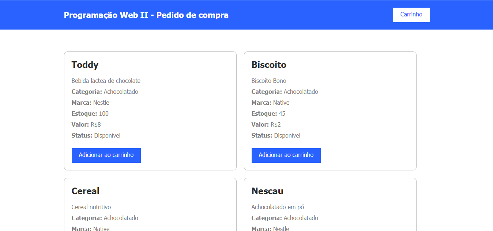
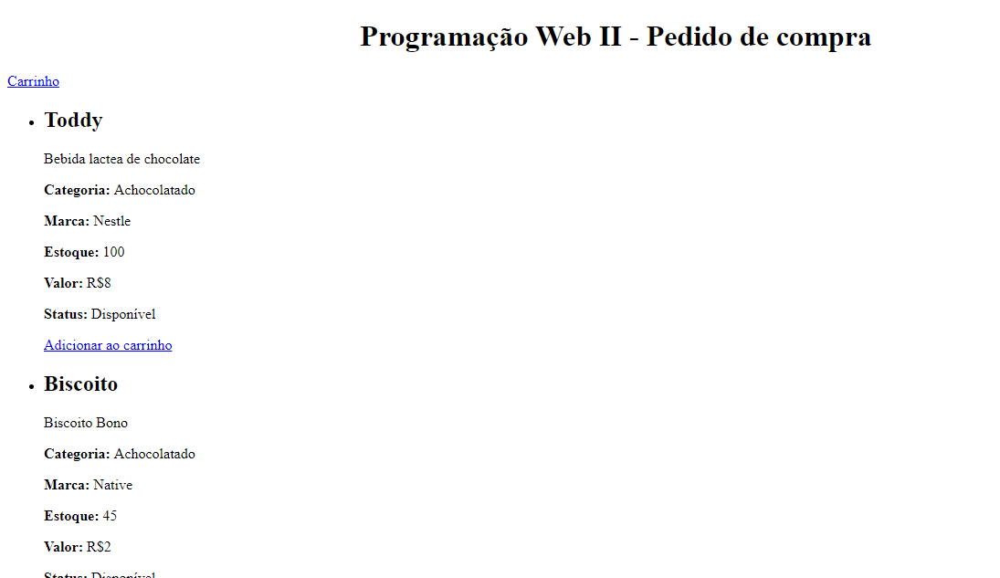
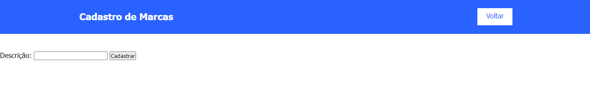
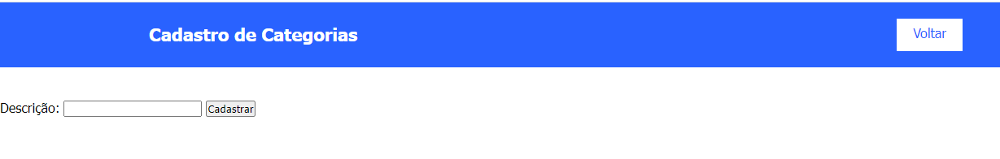
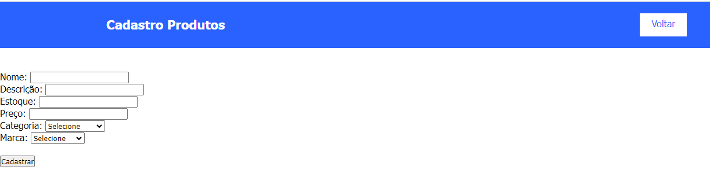
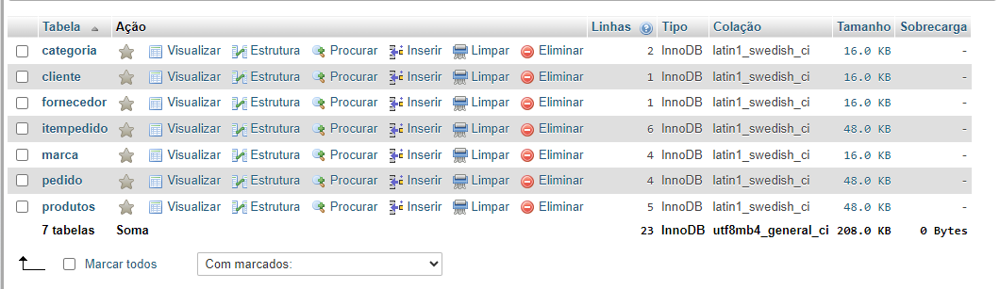

# CadEcommerce
Atividade avaliativa com o intuito dos alunos criarem juntamente com o professor as partes que precisavam ser feitas para completar o projeto CadEcommerce, para assim podermos adicionar marcas e categorias em nosso banco de dados.

## Funcionalidades 

- Cadastro de Produtos : Permite adicionar produtos ao sistema.
- Cadastro de marcas : Permite adicionar marcas ao sistema. 
- Cadastro de categorias : Permite adicionar categorias ao sistema.
- Visualização do carrinho : Mostra os produtos adicionados ao carrinho.

## Estrutura do projeto

O projeto se organiza com os seguintes arquivos principais:

- carrinho.php
- categoria.php
- index.php
- insere-categoria.php
- insere-marca.php
- insere-produto.php
- marca.php
- pedido.php
- produtos.php

## Páginas

### Exibe os produtos disponiveis na loja

### Exibe os produtos adicionados ao carrinho   

### Cadastra novas marcas ao banco de dados 

### Cadastra novas categorias ao banco de dados 

### Cadastrar Produtos 

## Métodos PhP

 ### include_once 
 "include_once ('controller/conexao.php')"
  Utilizado em casos em que o mesmo arquivo pode ser incluído e valiado mais de uma vez durante uma execução de um script em particular.

### require_once 
 A expressão require_once é idêntica a require exceto que o PHP verificará se o arquivo já foi incluído, e em caso afirmativo, não o incluirá novamente.

### if else
if(mysqli_affected_rows($mysqli)  != 0){
echo "
}else{
    echo " }
 Permite executar alguns comandos se uma condição for verdadeira e outros se ela for falsa.

### include 
include('controller/conexao.php');
 Inclui e avalia o arquivo informado
 while 
 Usado para executar as declarações aninhadas repetidamente, enquanto a expressão do while forem avaliadas como verdadeiras .

### die 
 Serve para indicar ao php que finalize a interpretação do script.

 ## Banco de dados 

 Utilizamos o phpMyAdmin que é um aplicativo web livre e de código aberto desenvolvido em PHP para administração do MySQL e MariaDB pela Internet. A partir deste sistema é possível criar e remover bases de dados, criar, remover e alterar tabelas, inserir, remover e editar campos, executar códigos SQL e manipular campos chaves.
 

 ## Tecnologias utilizadas

 - Vs Code 
 - Github
 - HTML5
 - PHP
 - CSS
 - Java Script
 - Chat GPT
 - PhpMyAdmin

 ## Fontes 

 (https://www.php.net/manual/pt_BR/function.include-once.php#:~:text=O%20include_once%20pode%20ser%20utilizado,valores%20de%20vari%C3%A1veis%2C%20e%20etc.  )  

 (https://www.php.net/manual/pt_BR/function.require-once.php#:~:text=require_once%20%C2%B6&text=A%20express%C3%A3o%20require_once%20%C3%A9%20id%C3%AAntica,difere%20de%20seus%20irm%C3%A3os%20_once%20.
   )  

   (http://www.nce.ufrj.br/ginape/js/conteudo/decisao/ifelse.htm#:~:text=O%20comando%20if%20%2D%20else&text=Permite%20executar%20alguns%20comandos%20se,outros%20se%20ela%20for%20falsa.&text=De%20acordo%20com%20a%20l%C3%B3gica,os%20comandos%20devem%20estar%20aninhados.
     )  

       

      

